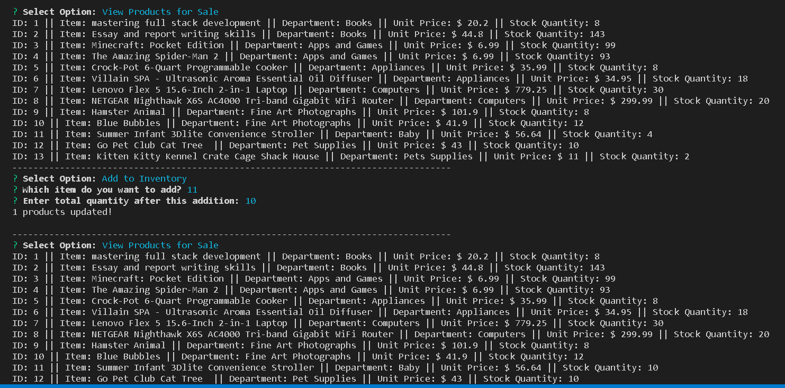

# bamazon
Bamazon Online Store
====================
Overview
-----------------------------------------------------------------
Bamazon is a mini online store where users can purchase goods from an array of merchandise. This is a backend app where users interact with a computer terminal instead of a browser.

Technology
-----------------------------------------------------------------
The user interface is deployed in a terminal using "node.js", and npm packages "inquirer" and "mysql". Data is stored in mysql server with mysql workbench as the user interface. "inquirer" gets user input and "mysql" manipulates database and data with CRUD (Create, Read, Update, Delete) commands. Program backbone is javascript.

How to Use
-----------------------------------------------------------------
bamazonCustomer.js displays a list of merchandise showing item ID, description and price. A user is prompted to enter item ID and quantiry to order. If the item is out-of-stock, the program shows stock-out message and prompts the user to select another item.

Stock Out Message - item 13 is hot!

After the order is placed, the user sees an order summary:

Order Summary:

-----------------------------------------------------------------
bamazonManager.js displays a menu of four options:
1. View Products for Sale
2. View Low Inventory (less than 11)
3. Add to Inventory
4. Add New Product

Option 1 shows the entire product inventory list.

Option 2 shows products with inventory of less than 10. 

Manager View Product and View Low Inventory List:

Option 3 prompts the user to add stock to the low inventory items by entering item ID and quantity. Based on exisitng inventory and low inventory information, the manager would add stock to the inventory.

Note: the program replaces the existing value with the new value. Therefore, the manager would first add the old invenotry quantity to the added quantity, then enter the total (new) quantity.

Entered 10 units to item 11:

Option 4 prompts the user to insert a new product by entering item description, department, quantiry and unit price.

Added item 12:

Navigation at Command Prompt
-----------------------------------------------------------------
type: node <program file name, including extension> to run that program

type: clear to clear the terminal

key <Control> + key <c> to return to Command Prompt