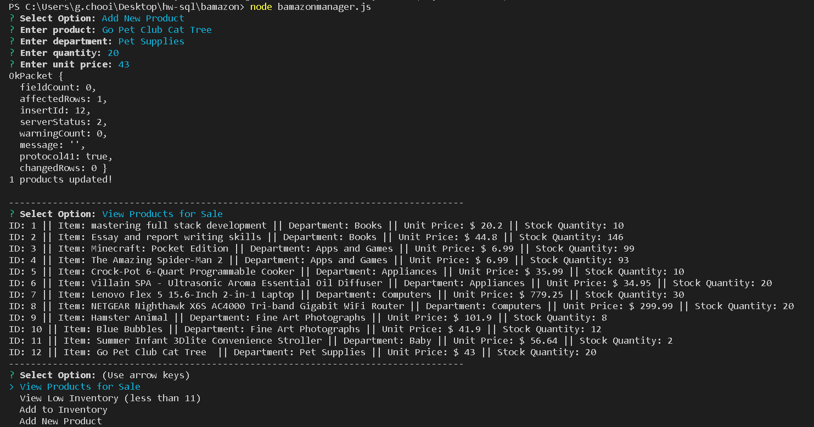

# bamazon
Bamazon Online Store
====================
Oveeview
-----------------------------------------------------------------
Bamazon is a mini online store where users can purchase stuff from an array of merchandise. This is a backend app where users interact with a computer terminal instead of a browser.

Technology
-----------------------------------------------------------------
The user interface is deployed in a terminal using "node.js" and npm packages "inquirer" and "mysql". "inquirer" provides the code to get user input and "mysql" serves as the data storage and data manipulation tool. The program backbone is javascript with json as the data formating technology.

How to Use
-----------------------------------------------------------------
bamazonCustomer.js displays a list of merchandise showing item ID, description and price. A user is prompted to enter item ID and quantiry to order. If the item is out-of-stock, the program shows stock-out message and prompts the user to select another item.

Stock Out Message:

After the order is placed, the user sees an order summary:

Order Summary:

-----------------------------------------------------------------
bamazonManager.js displays a menu of four options:
1. View Products for Sale
2. View Low Inventory (less than 11)
3. Add to Inventory
4. Add New Product

Option 1 shows the entire product inventory list.
Option 2 shows products with inventory of less than 10. 

Manager View Product and View Low Inventory List

OPtion 3 prompts the user to add stock to the low inventory items by entering item ID and quantity.
Note: the code does not keep existing value - it replaces the existing value with the new value
Option 4 prompts the user to insert a new product by entering item description, department, quantiry and unit price.

